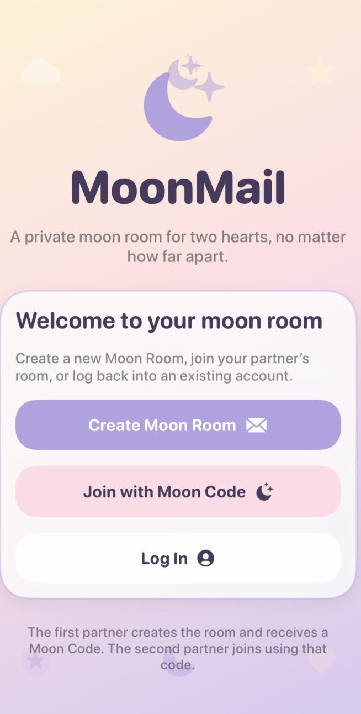
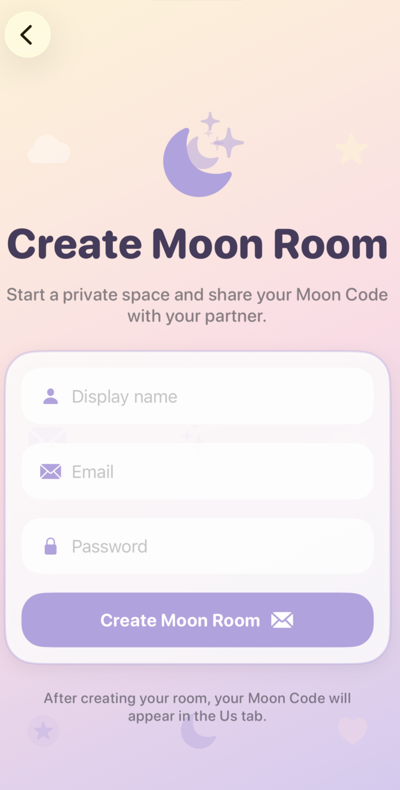
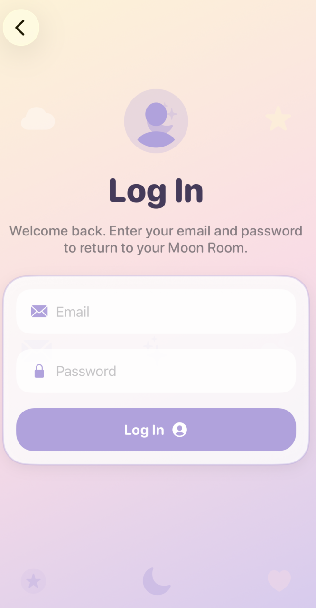
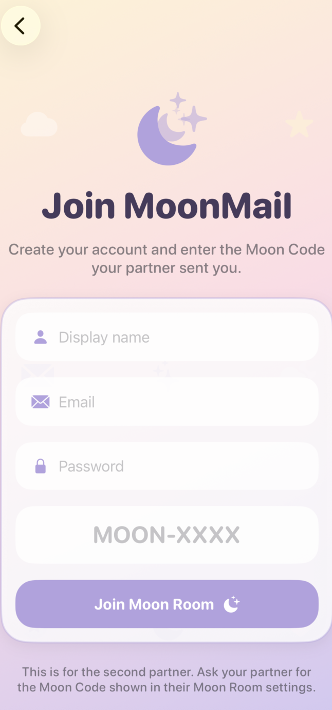
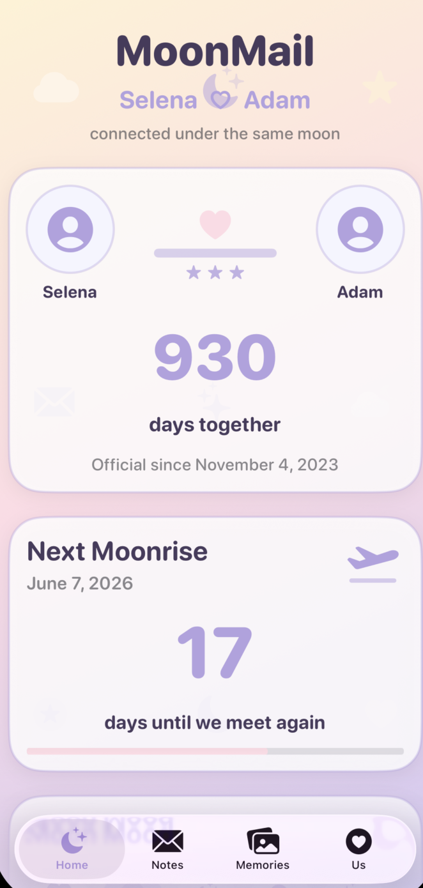
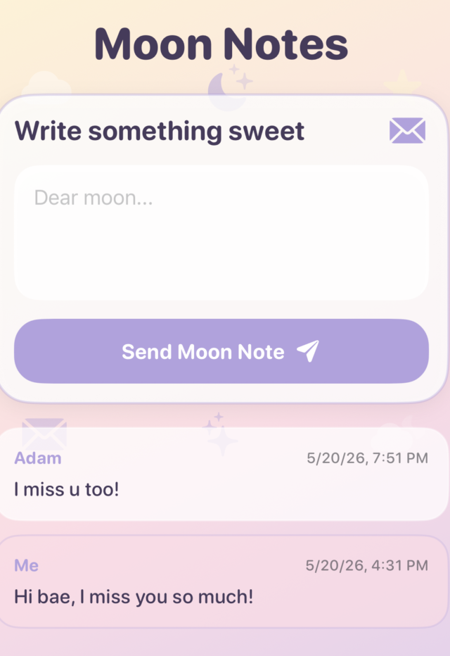
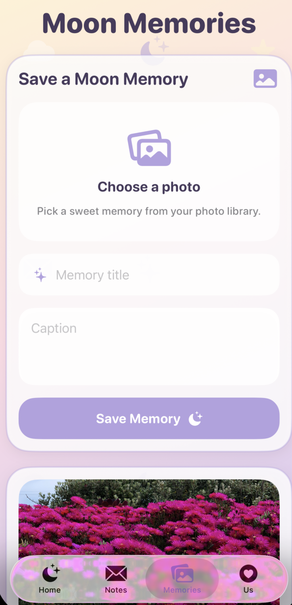
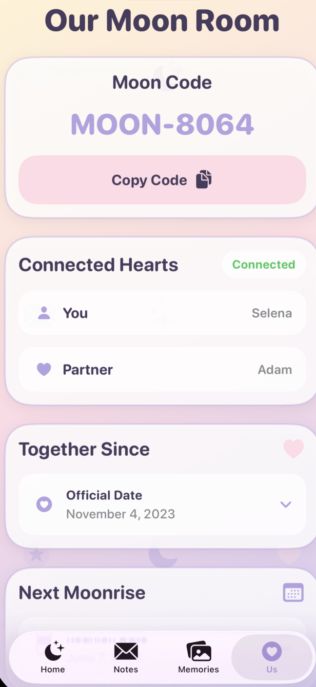

# MoonMail 🌙💜

MoonMail is a cozy long-distance couples app built with **SwiftUI** and **Firebase**. It gives two partners a private shared **Moon Room** where they can stay connected through notes, moods, memories, signals, and relationship milestones.

## Overview

MoonMail is designed for couples who want a soft, private digital space together. One partner creates a Moon Room and receives a unique **Moon Code**. The second partner joins using that code. Once connected, both partners share the same room and can interact in real time.

## Screenshots

<p align="center">
  
  
  
  
</p>

<p align="center">
  
  
  
  
</p>

## Features

### Authentication + Moon Room Flow
- Create a new private Moon Room
- Generate a unique Moon Code
- Join an existing Moon Room using that code
- Log in with email and password using Firebase Authentication
- Limit each Moon Room to exactly 2 people

### Home
- Shows both real partner names from Firestore
- Displays a **Together Since** card with days together
- Displays a **Next Moonrise** reunion countdown
- Shows shared Moon Mood updates
- Shows shared Moon Signals
- Shows recent signal activity

### Moon Notes
- Real-time shared notes between partners
- Notes are stored under the shared couple document
- Loading, success, error, and empty states polished

### Moon Mood
- Real-time mood updates for both partners
- Cute icon-based mood selection
- Shared mood visibility between both partners

### Moon Signals
- Real-time affection actions such as:
  - Moon Hug
  - Leave Star
  - Dream of Me
  - Moon Kiss
- Recent signal feed on the Home screen
- Improved loading, success, error, and empty states

### Moon Memories
- Upload photos with a title and caption
- Images stored in Firebase Storage
- Memory metadata stored in Firestore
- Both partners can view memories
- Only the uploader can delete their own memory
- Improved upload, loading, success, error, and empty states

### Us Tab
- Shows Moon Code
- Shows connected partner info
- Lets the couple set:
  - Official date
  - Reunion date
- Uses compact expandable date rows
- Includes copy-code feedback
- Reads live couple data from Firestore

## Technical Highlights

- Built with **SwiftUI** using a multi-file architecture
- Uses **Firebase Authentication** for account creation and login
- Uses **Cloud Firestore** for real-time shared data
- Uses **Firebase Storage** for memory image uploads
- Enforces a **two-person room limit**
- Uses **Firestore rules** and **Storage rules** for access control
- Includes **unit tests** for core date logic, partner-name logic, and signal time formatting
- Includes accessibility improvements across shared UI components
- Includes polished loading, success, error, and empty states

## Tech Stack

- Swift
- SwiftUI
- Firebase Authentication
- Cloud Firestore
- Firebase Storage
- Firebase iOS SDK
- Xcode
- Git / GitHub

## Firebase Setup

MoonMail uses the following Firebase services:

- Authentication → Email/Password
- Cloud Firestore
- Firebase Storage

The app is connected to Firebase using `GoogleService-Info.plist`.

## Firestore Structure

### Top-level collections
- `users`
- `couples`

### User document

Path:

```text
users/{uid}
